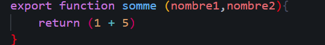
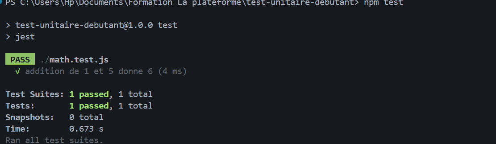
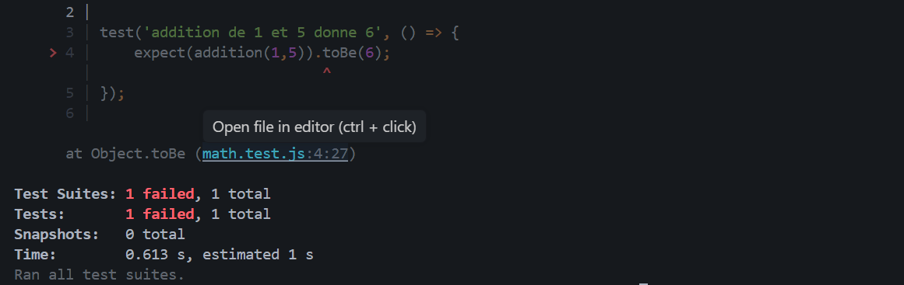

Initialisation projet Node.js

Installer Jest

Ajout de test Jest dans le package.json

Creation de la function addition Math.js

Creation de Math.test.js

test realiser

Modifier volontairement le code pour le faire échouer

Repasser le test en corrigant l'erreur.
